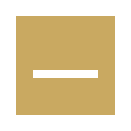
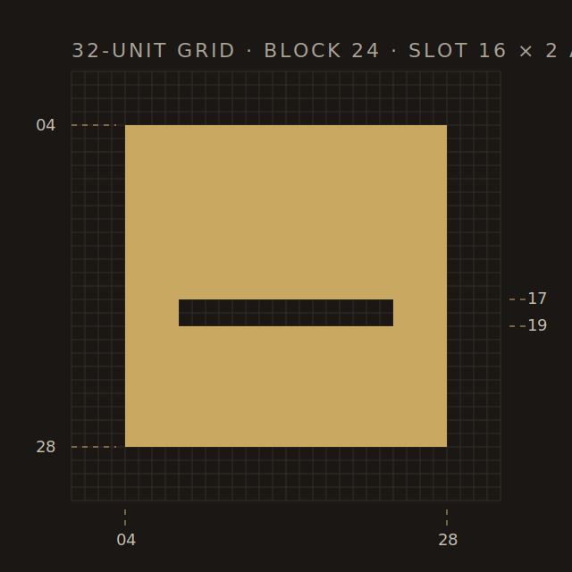

# Reverie · Brand Identity

A short reference for anyone working on Reverie's identity. Read this before
recoloring, redrawing, or laying out the mark in a new context.

---

## 1. The mark

Reverie's mark is the **Slot** — a solid block with a thin negative-space slot
cut horizontally below center.



The slot is a deliberate metaphor. A self-hosted library tool is, conceptually,
an act of **inscription**: you take a book and you commit it to your record.
The mark is a stone tablet with an inscription cut into it — small, weighted,
permanent. It is not a bookmark, not a page, not a logo for a reading app. It
is the act of cataloging itself, made into a shape.

The mark always appears **inline-left** of the wordmark in the canonical
lockup. It is not a frame, not a stacked element, not an ornament.

---

## 2. Tagline

> **Your library, catalogued.**

This is the canonical tagline. It is the only tagline. Use it whenever the
product needs to be categorized in a sentence.

**Where it lives:** Open Graph card, meta description, app store listing,
README, footer, homepage hero (as subhead under the wordmark), email
signatures, anywhere a stranger needs to know what Reverie is in three
words.

**Set in:** Author 400, sentence case, no italics. The comma is part of the
line — never drop it. Always trailed by a full stop.

**Don't:**

- Don't pair it with a second tagline. There is no atmospheric companion
  line; the workhorse carries the brand alone.
- Don't substitute synonyms ("organised," "on record," "in order"). The
  word is *catalogued*. The British spelling is intentional and locked.
- Don't translate or reflow it as marketing copy. "Catalogue your library
  with Reverie" is not the tagline.
- Don't set it in Satoshi. The tagline is the one place a serif appears in
  the lockup family — it's the editorial counterweight to the wordmark's
  geometric stamp.

---

## 3. Construction

The glyph is built on a **32 × 32 unit grid**.



| Element              | Spec                                            |
| -------------------- | ----------------------------------------------- |
| Grid                 | 32 × 32 units                                   |
| Block                | 24 × 24 units · 4u inset on all sides           |
| Slot width           | 16 units (50% of grid · 66.7% of block)         |
| Slot height          | 2 units (6.25% of grid)                         |
| Slot Y position      | 17u from top (53.1% — just below visual center) |
| Slot X position      | 8u from left (centered horizontally)            |

**The slot's vertical position is the most important rule.** It sits at 53%
from the top — *just below* visual center. Centered slots read mechanical
(an envelope, a mail slot). Below-center slots read **inscribed** (a carved
line in stone). Do not center the slot.

### Favicon variant (small-size fallback)

At 16–24px raster, the standard 2u slot can blur or fill from anti-aliasing.
Use the **favicon variant** (slot height 4u, width 14u) for any rendered
output below 24px. The proportional system is preserved; the slot is just
thicker so the carved gesture survives.

---

## 4. Color

Reverie uses two paint values plus a near-black canvas.

| Token       | Value     | Use                                              |
| ----------- | --------- | ------------------------------------------------ |
| Reverie Gold| `#C9A961` | The glyph fill. The accent. Single source of glow. |
| Ink         | `#0E0D0A` | Dark canvas. Wordmark on light surfaces.         |
| Cream       | `#E8E0D0` | Wordmark on dark surfaces.                       |
| Parchment   | `#E8DCC2` | Light theme canvas.                              |

**Reverie Gold is the only accent color.** Do not introduce additional
accents (red, blue, green) for status, navigation, or decoration. State
should be communicated through weight, opacity, and the gold accent —
never through hue.

---

## 5. Typography

| Role        | Family        | Weight | Tracking | Case      |
| ----------- | ------------- | ------ | -------- | --------- |
| Wordmark    | Satoshi       | 700    | 0.32em   | UPPERCASE |
| Display     | Author        | 500    | -0.012em | Sentence  |
| Body        | Satoshi       | 400/500| 0        | Sentence  |
| Italic accent | Author italic | 400/500 | -0.012em | Sentence |
| Monospace metadata | JetBrains Mono | 400 | 0.04em | UPPERCASE small |

**Author** is the display family — used for hero text, book titles in detail
views, italic accent moments. It does the editorial work.

**Satoshi** is the workhorse — used for body, navigation, controls, and the
wordmark itself. It does the structural work.

The wordmark uses Satoshi rather than Author because the wide-tracked stamp
treatment is itself doing identity work. Satoshi's neutral grotesque lets
that treatment carry, instead of competing with display character. Author
is reserved for places where the typeface itself should speak.

---

## 6. Lockup rules

The canonical brand expression is the lockup: glyph + wordmark, inline.


| Rule                | Spec                                                   |
| ------------------- | ------------------------------------------------------ |
| Layout              | Glyph left, wordmark right, baseline-aligned to center |
| Glyph size          | 0.95 × cap-height                                      |
| Gap                 | 0.5 × cap-height (≈ 14px at 28px wordmark size)        |
| Wordmark left-pad   | 0.32em (compensates for tracking optical balance)      |

There are three lockup forms, ranked by canonicality:

1. **Lockup with glyph** — canonical. Use everywhere you can.
2. **Glyph alone** — for favicons, app icons, very compressed contexts.
3. **Wordmark alone** — only when neither fits (footer microtext, plain-text
   email signatures). Never use as a primary mark.

**Why the hierarchy:** wide-tracked uppercase grotesques are a register
heavily used in fashion and luxury (think DTC minimalism). The wordmark
alone drifts toward that register. The glyph anchors it back to
archive/library. Without the glyph, the brand drifts; with the glyph, it
holds.

---

## 7. Don'ts

- Do not recolor the slot. It is always Reverie Gold.
- Do not center the slot vertically. It sits at 53% from top.
- Do not change the wordmark tracking. 0.32em is the spec.
- Do not switch the wordmark family to Author. Satoshi is the spec.
- Do not stack the lockup vertically. Inline-left is the spec.
- Do not add a frame, container, or shape behind the lockup unless using a
  `framed-*` variant (see Asset index).
- Do not rotate, skew, or distort the glyph.
- Do not apply effects (shadow, glow, gradient, bevel, outline).
- Do not use the wordmark alone as a primary mark.
- Do not introduce additional accent colors. Gold is the only accent.

---

## 8. Asset index

All assets are in `brand/`. Use SVG wherever possible — raster files exist
only for contexts that don't accept SVG (older browsers, social media,
operating-system icons).

### Glyph (`brand/glyph/`)

| File                       | Use                                          |
| -------------------------- | -------------------------------------------- |
| `slot.svg`                 | Canonical. Gold on transparent.              |
| `slot-favicon.svg`         | Small-size fallback (16–24px raster).        |
| `slot-on-dark.svg`         | Gold on Ink — for printing on light surfaces.|
| `slot-on-parchment.svg`    | Gold on Parchment — for printing on dark surfaces. |
| `slot-mono-light.svg`      | Cream on transparent. Single-color light.    |
| `slot-mono-dark.svg`       | Ink on transparent. Single-color dark.       |

### Lockup (`brand/lockup/`)

| File                        | Use                                             |
| --------------------------- | ----------------------------------------------- |
| `lockup-on-dark.svg`        | Canonical for dark UI. Gold + Cream, transparent.|
| `lockup-on-light.svg`       | Canonical for light UI. Gold + Ink, transparent. |
| `lockup-framed-dark.svg`    | Gold + Cream on Ink frame. Use on imagery/photos.|
| `lockup-framed-light.svg`   | Gold + Ink on Parchment frame.                   |
| `lockup-mono-light.svg`     | All-Cream. Single-color light contexts.          |
| `lockup-mono-dark.svg`      | All-Ink. Single-color dark contexts.             |

### Raster (`brand/raster/`)

| File                          | Use                                          |
| ----------------------------- | -------------------------------------------- |
| `favicon-16.png`              | Browser tab favicon (legacy fallback).       |
| `favicon-32.png`              | Browser tab favicon (high-DPI).              |
| `favicon-48.png`              | Windows shortcut icon.                       |
| `apple-touch-icon-180.png`    | iOS home-screen icon. Framed (Ink + Gold).   |
| `glyph-256.png`               | Standalone glyph raster. Email signatures.   |
| `glyph-512.png`               | App store / Play store icon.                 |
| `glyph-1024.png`              | macOS app icon, App Store master.            |
| `og-card-1200x630.png`        | Open Graph / Twitter card share image.       |

### Construction (`brand/proportions/`)

| File                         | Use                                          |
| ---------------------------- | -------------------------------------------- |
| `slot-construction.svg`      | Annotated grid diagram. For docs only.       |

---

## 9. HTML integration

The minimum favicon block to drop into the React app's `index.html`:

```html
<link rel="icon" type="image/svg+xml" href="/brand/glyph/slot-favicon.svg" />
<link rel="icon" type="image/png" sizes="16x16" href="/brand/raster/favicon-16.png" />
<link rel="icon" type="image/png" sizes="32x32" href="/brand/raster/favicon-32.png" />
<link rel="apple-touch-icon" sizes="180x180" href="/brand/raster/apple-touch-icon-180.png" />
<meta property="og:image" content="/brand/raster/og-card-1200x630.png" />
<meta property="og:image:width" content="1200" />
<meta property="og:image:height" content="630" />
```

Modern browsers will prefer the SVG favicon; older ones fall back to the PNGs.

---

## 10. Decision log

The mark and lockup were chosen over a number of alternatives explored
during the typography + identity phase. For context, the alternates that
got close:

- **Open Brackets** (D5) — bracketed-R monogram. Strong working mark, but
  registered too "literary brand" and didn't argue for the inscription thesis.
- **Dog-Ear** (G3) — folded-corner glyph. Read as "bookmark app," too
  literal for the position.
- **Inset** (A6) — outline + off-center solid square. Closest abstract
  alternative. Lost on stroke-weight mismatch with the stamp wordmark.
- **Aperture** (A1) — interlocking arcs. Mechanical-precise but the
  focused-view metaphor stretched too far for a cataloging tool.

The Slot was chosen because it is the only mark in the explored set that
*embodies* the act of inscription rather than gesturing at it. Documented
here so we don't relitigate the decision when someone asks why not a book.
